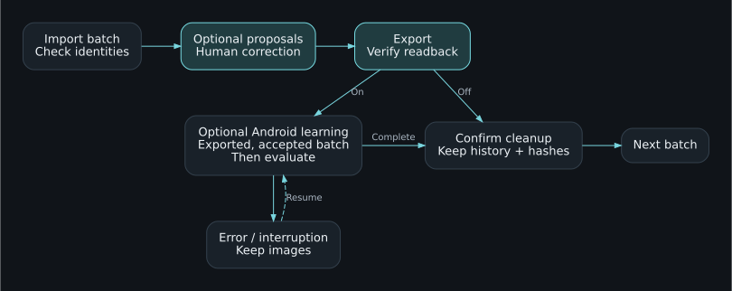
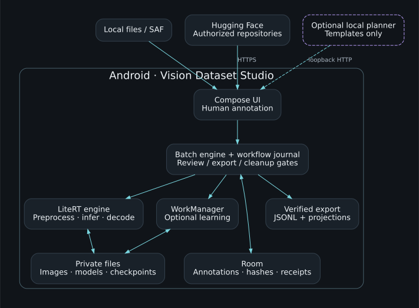

# Vision Dataset Studio — Unicorn Who Dev

[Français](README.md) · **English**

An Android workspace for producing image datasets in batches: model proposals, human correction and export. A compact dark interface keeps the image at the centre of the work.

**4.2.0-rc5 · Apache-2.0 · Under qualification**
Android application ID: `com.unicornwhodev.visiondatasetstudio`

**Installing rc5:** Debug prerelease with a different signing certificate from rc4.
It cannot update an existing rc4 installation. Preserve its data and signing key;
see the [release and package notes](docs/RELEASE_PLAN.md).

**23 September 2026:** real Windows build, **67 JVM tests, 70 Python tests (63 at build time plus 7 packaging checks), 39/39 Android core tests on both 4 KB and 16 KB emulators**, no skips. The Flex crash is fixed. The original model is preserved and later training continues the learned version. ARM64 candidate: **100.2 MB**, unsigned. Three other native libraries retain strict RELRO findings; whole-app 16 KB and physical ARM qualification remain open. [Evidence and limits](docs/WINDOWS_QUALIFICATION_2026_09.md).

## Application screenshots

| Historical rc3 workspace | Annotation editor |
|---|---|
| [](test-results/litert-rc3/final-device/app-ready.png) | [](docs/ui-refined/refined-editor-persisted.png) |

Real Android emulator captures. Left: final rc3 build after startup. Right: editor QA from 19 September, with a synthetic image and a persisted annotation; historical capture, not a new rc3 test. [Image provenance and full-size gallery](docs/VISUALS.md). The banner is a generated illustration.

## Main workflow

**Import → preannotate → correct/review → export and verify → optional learning → clean up → next batch.**

Learning is **off by default**. When enabled, it uses only the corrected, exported batch, and cleanup waits until learning finishes. New weights require manual activation. Manual annotation and export work without a model. A model without training signatures remains importable and usable for inference, with no SHA manifest required.

Changing a prompt or setting never changes saved annotations. Reprocessing requires an explicit user action; human corrections remain protected.

Persistent file and decoded-pixel fingerprints prevent identical copies from entering later batches of the same project. The ledger survives cache cleanup. Edited near-duplicates and lossy recompressions are outside this exact-identity guarantee.

**The APK contains no model weights.** It includes the runtime and integration tools; models are downloaded or imported after installation. Learning runs on Android. The pod is used for development and QA.



## System architecture



All production state, inference and optional learning live on Android. The optional local planner proposes a workflow; it cannot approve annotations, publish, clean up or activate weights. [Architecture, data boundaries and source map](docs/en/ARCHITECTURE.md).

## Features and status

The functional audit adds applied model settings, visible workflow instructions, English application flows and preservation of existing annotations. See the [functional report](docs/en/FUNCTIONAL_AUDIT_2026_09.md).

| Feature | Status |
|---|---|
| Local / HF import, configurable batches, correction and export | Implemented; local 2+1 cycle verified on Android |
| Persistent identity, resume and protected cleanup | Android tests passed, including renamed copies and concurrent claims |
| Android learning, checkpoints, cancel/resume | Eight HF conversions passed train/save/restore/resume; their encoders remain frozen |
| HF download, LiteRT contracts and preprocessing | Configurable catalogue, optional SHA manifests, tensor-checked contracts; see the execution matrix |
| Tokenizers and persistent similarity index | Android tests passed |
| TinyCLIP / SAM / Florence-2 bundles | TinyCLIP executed with visible proposals; SAM and Florence remain to be qualified |
| Mask editor/export | Brush, eraser, separate instances, canonical and COCO export; gesture test passed |
| Inference-only RTMDet | Inference and dynamic outputs verified after fixing the decoder |
| Executable workflows | Three templates, journal/resume, review/export/cleanup gates; guard tests passed |
| Agent | Optional local HTTP planner; separate user-provided server, real integration pending |

See [executed validation](docs/en/VALIDATION.md) and [the roadmap](docs/en/ROADMAP.md). This repository shares source code under qualification; the product is not yet complete or ready for a stable release.

## Using the workspace

1. Create a project and choose its tasks, labels, source and batch size.
2. Import a local folder/manifest or configure HF, then index the source.
3. Download/import a model when preannotation is wanted. Check its contract and test one image.
4. Prepare the batch, review proposals, correct annotations and accept or reject each image.
5. Create an archive, choose its destination and verify readback, or publish and verify to an authorized HF destination.
6. If learning is enabled, wait until it finishes. Confirm cleanup and prepare the next batch.

Canonical annotations are retained. COCO, YOLO, WebDataset and vision-language outputs are optional projections with their own constraints; they do not replace canonical JSONL.

## LiteRT evidence


This figure covers the **25 public Charlbi variants**. Four passed Android train/save/restore/resume; RepViT passed inference. The six additional authorized-source conversions are outside this public chart. [Executed results, checkpoint figures and timing limitations](docs/en/LITERT_QUALIFICATION.md) · [Full model documentation](https://huggingface.co/Charlbi/Lite_rt_prepared_for_android_dataset_builder). No phone speed or accuracy claim.

[Resume on your workstation](docs/en/DEVELOPMENT_RESUME.md): setup, commands, test status and remaining work.

## Build and test

Validated build environment: JDK 21, Python 3.11+, Android SDK 36, build-tools 36.0.0 and Gradle 9.3.1. The Python Gradle bootstrap verifies the downloaded distribution; the original archive did not contain a wrapper JAR.

Before the first Android build, prepare the [16 KB Flex runtime](docs/FLEX_16K.md)
on Linux/WSL. Its sources and tools are pinned; subsequent Windows builds reuse
the verified local AAR. CI builds this runtime in a dedicated job.

```bash
bash tools/build_android.sh
```

Each attempt creates `dist/android/runs/<id>/status.json`. It records the signatures, identities and hashes of the two APKs actually built. `app-contents.json` checks for bundled weights. A failed attempt is not promoted to a qualified build.

On a dedicated QA device:

```bash
export ANDROID_SERIAL=emulator-5554
export VDS_ALLOW_TEST_INSTALL=1
bash tools/qa/run_device_qualification.sh
```

Model tests need fixtures staged separately and may be skipped when those are absent. Physical ARM devices, performance, API 28/35 CI and real HF writes still require qualification. Emulator results are functional evidence, not device performance measurements.

## Documentation and repository

- [FR/EN documentation index](docs/README.md), [batch production](docs/en/BATCH_PRODUCTION.md), [training contract](docs/en/LITERT_TRAINING_CONTRACT.md).
- [Workflows](docs/en/WORKFLOWS.md), [LiteRT qualification](docs/en/LITERT_QUALIFICATION.md).
- [Roadmap](docs/en/ROADMAP.md), [release plan](docs/en/RELEASE_PLAN.md), [contributing](CONTRIBUTING.md).
- [Workstation guide](docs/WORKSTATION.md) and [UI evidence](docs/UI_REFINEMENT.md) are currently French technical references.

Authorized public destination: [unicornwhodev/vision-dataset-studio](https://github.com/unicornwhodev/vision-dataset-studio). The [qualification prerelease](https://github.com/unicornwhodev/vision-dataset-studio/releases/tag/v4.2.0-rc4) distributes the user APK and QA package. GHCR stores that package as an OCI artifact; the build Dockerfile remains untested because GitHub Actions is blocked by an account billing issue. See the [publication plan](docs/en/RELEASE_PLAN.md). No stable release is claimed.

Project code uses [Apache-2.0](LICENSE), subject to contributor rights. Models, datasets and dependencies keep their own licences; see [NOTICE](NOTICE) and [licensing status](LICENSING_STATUS.md).

Changing the application ID does not migrate another app’s data. Room migrations 1/2/3 → 4 apply only to the same Android identity. Keep an older installation until its data has a verified backup.
