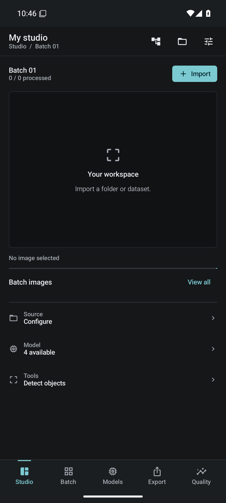

# Vision Dataset Studio

**Des images aux datasets, avec l’IA pour proposer et l’humain pour décider.**

Atelier Android pour importer des images, travailler par lots, corriger les propositions des modèles et produire des exports vérifiés. L’apprentissage local est facultatif : le modèle original reste disponible, tandis qu’une version séparée progresse avec les lots validés.

**Français** · [English](README.en.md)

[Commencer](docs/GETTING_STARTED.md) · [Télécharger rc5](https://github.com/unicornwhodev/vision-dataset-studio/releases/tag/v4.2.0-rc5) · [Documentation](docs/README.md) · [Modèles LiteRT](https://huggingface.co/Charlbi/Lite_rt_prepared_for_android_dataset_builder)

| Version | Plateforme | Licence du code | État |
|---|---|---|---|
| **4.2.0-rc5** | Android 9+ · API 28+ | [Apache-2.0](LICENSE) | Prérelease de qualification |

> **Installation :** rc5 utilise un certificat différent de rc4 et ne peut pas la mettre à jour. Conservez toute installation contenant des données. Le candidat ARM64 de 100,2 Mo est **non signé**. [Choisir le bon fichier](docs/GETTING_STARTED.md#installer-la-prerelease).

## Un atelier, tout le cycle du lot

**Importer → proposer → corriger → exporter et vérifier → apprendre si activé → nettoyer après confirmation.**

| Dans l’atelier | Ce que vous maîtrisez |
|---|---|
| **Sources et lots** | Dossier local ou source HF, taille des lots, reprise et identité persistante des images |
| **Préannotation** | Modèle et paramètres choisis ; les annotations existantes ne sont recalculées que sur demande explicite |
| **Revue humaine** | Boîtes, points, masques, acceptation/rejet et protection des corrections enregistrées |
| **Exports** | JSONL canonique, projections COCO, YOLO, WebDataset et vision-langage selon la tâche |
| **Apprentissage Android** | Lot corrigé et exporté, checkpoints, interruption/reprise et activation explicite des nouveaux poids |
| **Nettoyage** | Confirmation et preuve de copie relue ; les reçus et l’historique anti-doublons restent disponibles |

Le parcours manuel fonctionne sans modèle. **Aucun poids n’est embarqué dans l’APK** : les modèles sont importés ou téléchargés séparément. L’apprentissage est désactivé par défaut.

## Voir l’application

| Studio rc5 · recette du 23 septembre | Éditeur · recette historique du 19 septembre |
|---|---|
|  |  |

Captures réelles et intactes sur émulateur. La bannière est une illustration générée. [Galerie et provenance](docs/VISUALS.md).

## Garder l’original, poursuivre la version entraînée


Le premier entraînement crée une copie distincte. Les suivants reprennent ses derniers poids validés, même si l’original reste sélectionné pour l’inférence. Chaque tentative conserve son checkpoint et son reçu ; l’activation pour la préannotation reste un choix explicite.

Le graphe **et** son checkpoint constituent la version entraînée. Un checkpoint absent ou altéré bloque la reprise. Les conversions actuellement fournies entraînent des têtes ou adaptations de sortie avec encodeur figé ; le réseau synthétique de recette démontre séparément la mise à jour de couches internes. [Fonctionnement et preuves](docs/MODEL_LINEAGE.md).

## Commencer selon votre besoin

| Votre objectif | Point d’entrée |
|---|---|
| Préparer un premier dataset | [Guide de prise en main](docs/GETTING_STARTED.md) |
| Choisir et utiliser un modèle | [Conversions Charlbi](https://huggingface.co/Charlbi/Lite_rt_prepared_for_android_dataset_builder) · [Contrat LiteRT](docs/LITERT_TRAINING_CONTRACT.md) |
| Explorer les modèles feu/fumée | [Catalogue public FireViewer](https://huggingface.co/fireviewer/litert-models) — qualification distincte |
| Construire ou contribuer | [Poste de développement](docs/DEVELOPMENT_RESUME.md) · [Architecture](docs/ARCHITECTURE.md) · [Contribution](CONTRIBUTING.md) |
| Vérifier une livraison | [Tests](TEST_REPORT.md) · [Limites](KNOWN_LIMITATIONS.md) · [Reçu rc5](docs/RC5_PUBLICATION_RECEIPT.json) |

## Ce qui est vérifié aujourd’hui

| Périmètre | Résultat enregistré | Limite de la preuve |
|---|---|---|
| Build Windows rc5 | **67 JVM**, KSP généré, lint sans erreur | 88 avertissements de lint |
| Outils Python | **70 tests réussis** | 63 au build, 7 contrôles de packaging ajoutés |
| Android API 35, pages 4 Ko | **39/39**, aucun ignoré | Émulateur x86_64 |
| Android API 35, pages 16 Ko | **39/39**, aucun ignoré ; crash Flex corrigé | Trois autres bibliothèques gardent des signalements RELRO |
| Entraînement et filiation | Original intact, deux lots en continuité, reprise et persistance après redémarrage | Données synthétiques |
| Catalogue Charlbi, campagne du 22 septembre | **13/25 réussies**, dont **8 avec apprentissage** ; 1 délai dépassé, 11 non exécutées | API 28 x86_64, builds antérieurs à rc5 ; aucun benchmark ARM |

[Preuves Windows](docs/WINDOWS_QUALIFICATION_2026_09.md) · [Résultats par modèle](docs/LITERT_QUALIFICATION.md).

La recette complète du catalogue, le téléphone ARM, la qualité sur corpus indépendant, les transferts HF réels et la nouvelle CI restent à qualifier. Une suite réussie sur émulateur ne prouve ni la précision des modèles ni la compatibilité 16 Ko de toute l’APK.

## Construire sur votre poste

Prérequis : **JDK 21, Python 3.11+, SDK Android 36 et build-tools 36.0.0**. Le bootstrap récupère et vérifie Gradle 9.3.1. Préparer une fois le [runtime Flex 16 Ko](docs/FLEX_16K.md), depuis le ZIP vérifié de rc5 ou par reconstruction Linux/WSL, puis :

```powershell
git clone https://github.com/unicornwhodev/vision-dataset-studio.git
cd vision-dataset-studio
python -X utf8 tools/build_android.py
```

Définir `JAVA_HOME` et `ANDROID_HOME` pour votre poste. Chaque tentative écrit un reçu sous `dist/android/runs/` avec les empreintes des APK réellement produites. [Installation, fixtures et recette Android](docs/DEVELOPMENT_RESUME.md).

## État du projet et prochaines étapes

La prérelease distribue une APK Debug de **413,9 Mo**, une archive de qualification, le runtime Flex, un candidat ARM64 optimisé **non signé de 100,2 Mo** et leurs reçus. GHCR conserve le package d’artefacts en accès privé ; les fichiers de release GitHub sont publics.

La [feuille de route](docs/ROADMAP.md) priorise la qualification des données et des appareils, les conversions et leur qualité, puis la signature durable et les notices transitives. L’agent HTTP local, SAM et Florence-2 ont encore des intégrations à qualifier.

## Droits et protection des données

Le code est sous [Apache-2.0](LICENSE). Les modèles, corpus et composants tiers gardent leurs propres conditions et [attributions](NOTICE). Les 111 dépendances runtime sont inventoriées dans [third_party](third_party/README.md) ; la revue des notices natives transitives reste ouverte.

Les corrections humaines, reçus d’export et modèles originaux doivent être conservés. Aucun token, keystore, poids ou corpus utilisateur n’a sa place dans Git. [Contrôles de publication](docs/PUBLICATION_CHECKS.md) · [Limites connues](KNOWN_LIMITATIONS.md).

<sub>Unicorn Who Dev · Identité Android : <code>com.unicornwhodev.visiondatasetstudio</code> · Documentation actualisée le 23 septembre 2026.</sub>
