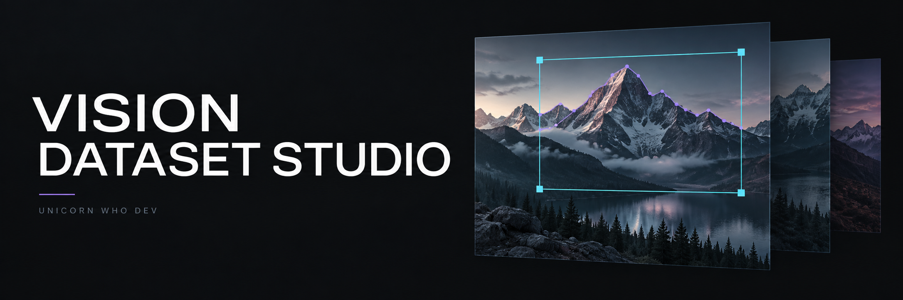
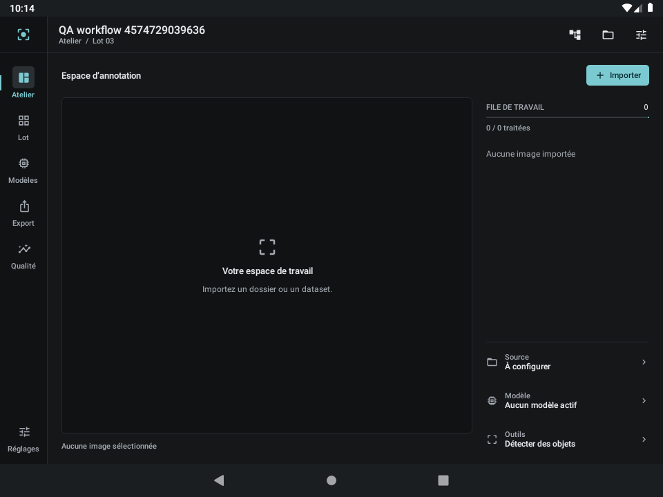
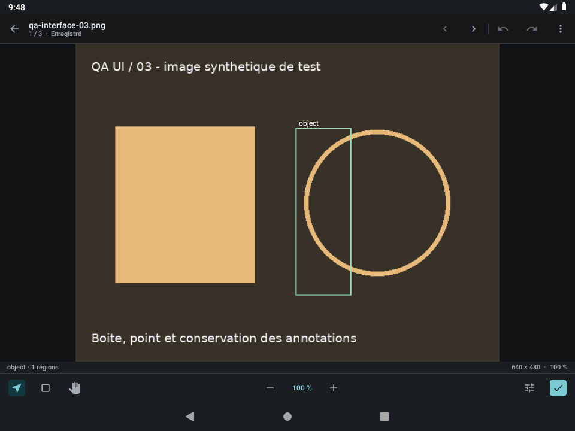
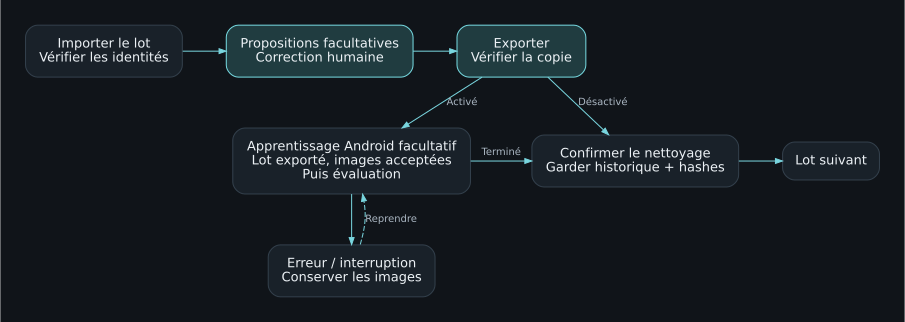
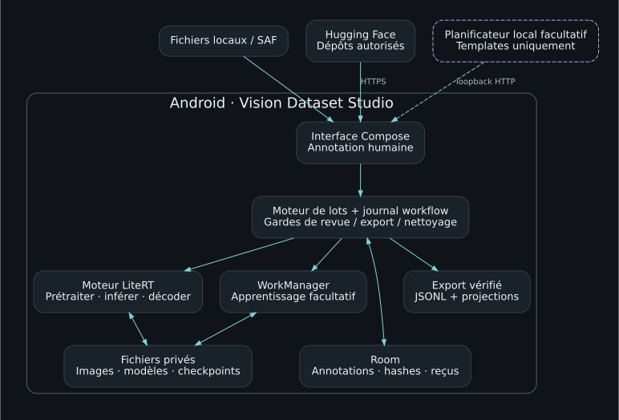
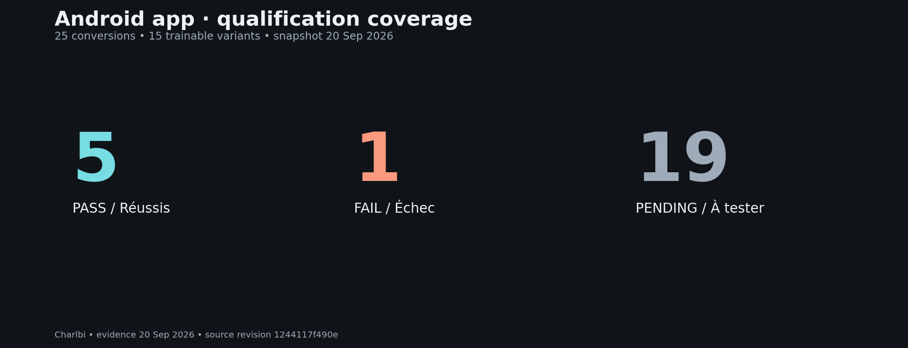

# Vision Dataset Studio — Unicorn Who Dev

**Français** · [English](README.en.md)

Atelier Android pour produire des datasets d’images par lots : préannotation, correction humaine et export. Interface sombre compacte, image au centre du travail.

**4.2.0-rc4 · Apache-2.0 · En qualification**
Identifiant Android : `com.unicornwhodev.visiondatasetstudio`

Dernière validation **rc4 · 22 septembre 2026** : **54 JVM, 24 Android de base, 2 régressions LiteRT et 52 Python réussis**. [Build, preuves et limites](test-results/stabilization-rc4/README.md).

## L’application en images

| Atelier rc3 actuel | Éditeur d’annotations |
|---|---|
| [](test-results/litert-rc3/final-device/app-ready.png) | [](docs/ui-refined/refined-editor-persisted.png) |

Captures réelles sur émulateur Android. À gauche : build rc3 final après démarrage. À droite : recette de l’éditeur du 19 septembre, image synthétique et annotation conservée ; capture historique, pas un nouveau test rc3. [Provenance et galerie en pleine taille](docs/VISUALS.md). La bannière est une illustration générée.

## Parcours principal

**Importer → préannoter → corriger/valider → exporter et vérifier → apprentissage facultatif → nettoyer → lot suivant.**

L’apprentissage est **désactivé par défaut**. S’il est activé, il porte uniquement sur le lot corrigé et exporté ; le nettoyage attend sa fin. Les nouveaux poids sont activés manuellement. Le traitement manuel et les exports fonctionnent sans modèle.

Les empreintes de fichiers et de pixels empêchent de réintroduire une copie identique dans les lots suivants du même projet. Elles restent en base après la purge. Les quasi-doublons retouchés ou recompressés avec pertes ne sont pas couverts par cette garantie.

**L’APK n’embarque aucun poids.** Le runtime et les outils sont intégrés ; les modèles sont téléchargés ou importés après installation. L’apprentissage s’exécute sur Android. Le pod sert au développement et à la recette.



## Architecture du système



L’état de production, l’inférence et l’apprentissage facultatif restent sur Android. Le planificateur local optionnel propose un workflow ; il ne peut ni valider les annotations, ni publier, nettoyer ou activer des poids. [Architecture, données et sources](docs/ARCHITECTURE.md).

## Fonctions et état

La stabilisation de septembre 2026 sépare maintenant l'intégrité des artefacts runtime de la documentation des modèles, expose les capacités/qualifications et distingue une inférence vide d'un échec. Voir [le rapport de stabilisation](docs/STABILIZATION_2026_09.md). Ces corrections ne valent pas qualification d'un modèle non exécuté.

| Fonction | État |
|---|---|
| Import local / HF, lots configurables, correction et exports | Implémentés ; cycle local 2+1 vérifié sur Android |
| Identité persistante, reprise et purge protégée | Tests Android réussis, dont copies renommées et concurrence |
| Apprentissage Android, checkpoints, interruption/reprise | Quatre conversions HF ont passé train/save/restore/reprise ; encodeurs figés par ces conversions |
| Téléchargement HF, contrats et prétraitement LiteRT | Catalogue configurable, révisions et SHA-256 vérifiés ; RepViT et quatre conversions entraînables exécutés |
| Tokeniseurs et similarité persistante | Tests Android réussis |
| Bundles TinyCLIP / SAM / Florence-2 | Adaptateurs présents ; tests des conversions à terminer |
| Éditeur/export de masques | Pinceau, gomme, instances distinctes, export canonique et COCO ; test de geste réussi |
| RTMDet sans apprentissage | Décodeur implémenté ; incompatibilité de forme encore ouverte à l’exécution |
| Workflows exécutables | Trois templates, journal/reprise, pauses de revue/export/nettoyage ; tests de garde réussis |
| Agent | Planificateur HTTP local optionnel ; serveur fourni séparément, intégration réelle à qualifier |

Les [résultats exécutés](TEST_REPORT.md) et les [limites](KNOWN_LIMITATIONS.md) font foi. Le dépôt partage les sources en qualification ; le produit n’est pas encore complet ni prêt pour une release stable.

## Utiliser l’atelier

1. Créer un projet et choisir ses tâches, classes, source et taille de lot.
2. Importer un dossier/manifeste local ou configurer HF, puis indexer la source.
3. Télécharger/importer un modèle si la préannotation est souhaitée ; vérifier son contrat et essayer une image.
4. Préparer le lot, contrôler les propositions, corriger et valider ou rejeter chaque image.
5. Créer l’archive, choisir son emplacement et vérifier sa relecture, ou publier/vérifier sur une destination HF autorisée.
6. Si l’apprentissage est activé, attendre sa fin. Confirmer le nettoyage puis préparer le lot suivant.

Les annotations canoniques sont conservées. COCO, YOLO, WebDataset et vision-langage sont des sorties complémentaires avec leurs contraintes propres. Une projection ne remplace pas le JSONL canonique.

## Preuves LiteRT



Ce graphique couvre les **25 variantes publiques Charlbi**. Quatre ont passé train/save/restore/reprise Android ; RepViT a passé l’inférence. Les six conversions d’une autre source autorisée sont hors de ce graphique public. [Résultats, checkpoints et limites des durées](docs/LITERT_QUALIFICATION.md) · [Documentation complète des modèles](https://huggingface.co/Charlbi/Lite_rt_prepared_for_android_dataset_builder). Aucune vitesse téléphone ni précision métier annoncée.

## Construire

Environnement utilisé : JDK 21, Python 3.11+, SDK Android 36, build-tools 36.0.0, Gradle 9.3.1. Le bootstrap Gradle Python vérifie la distribution ; ce n’est pas un wrapper JAR livré dans l’archive initiale.

```bash
bash tools/build_android.sh
```

Chaque tentative produit `dist/android/runs/<id>/status.json`. Le reçu contient les signatures, identités et empreintes des deux APK réellement assemblées ; `app-contents.json` vérifie l’absence de poids. Un échec n’est jamais promu en qualification.

Pour un appareil de recette dédié :

```bash
export ANDROID_SERIAL=emulator-5554
export VDS_ALLOW_TEST_INSTALL=1
bash tools/qa/run_device_qualification.sh
```

Les tests de modèles nécessitent des fixtures injectées séparément et peuvent être ignorés en leur absence. Le téléphone ARM, les performances, la CI API 28/35 et les écritures HF réelles ne sont pas encore qualifiés. Voir [la recette](docs/ANDROID_QUALIFICATION.md).

## Documentation et dépôt

- [Guide FR/EN](docs/README.md), [production par lots](docs/BATCH_PRODUCTION.md), [contrat d’apprentissage](docs/LITERT_TRAINING_CONTRACT.md).
- [Workflows](docs/WORKFLOWS.md), [qualification LiteRT](docs/LITERT_QUALIFICATION.md).
- [Roadmap](docs/ROADMAP.md), [plan de publication](docs/RELEASE_PLAN.md), [contribution](CONTRIBUTING.md).
- [Poste de développement](docs/WORKSTATION.md), [interface](docs/UI_REFINEMENT.md).

Destination autorisée : dépôt public [unicornwhodev/vision-dataset-studio](https://github.com/unicornwhodev/vision-dataset-studio). La [prérelease de qualification](https://github.com/unicornwhodev/vision-dataset-studio/releases/tag/v4.2.0-rc4) distribue l’APK utilisateur et le paquet de recette. GHCR héberge ce paquet au format OCI ; le Dockerfile de build reste à éprouver, GitHub Actions étant bloqué par la facturation du compte. Voir le [plan de publication](docs/RELEASE_PLAN.md). Aucune release stable n’est annoncée.

Le code relève d’[Apache-2.0](LICENSE), selon les droits des contributeurs. Les modèles, données et bibliothèques conservent leurs licences ; voir [NOTICE](NOTICE) et [l’état des droits](LICENSING_STATUS.md).

Le changement d’applicationId ne transfère pas les données d’une autre application. Les migrations Room 1/2/3 → 4 concernent uniquement la même identité Android ; conserver l’ancienne installation jusqu’à sauvegarde vérifiée.
