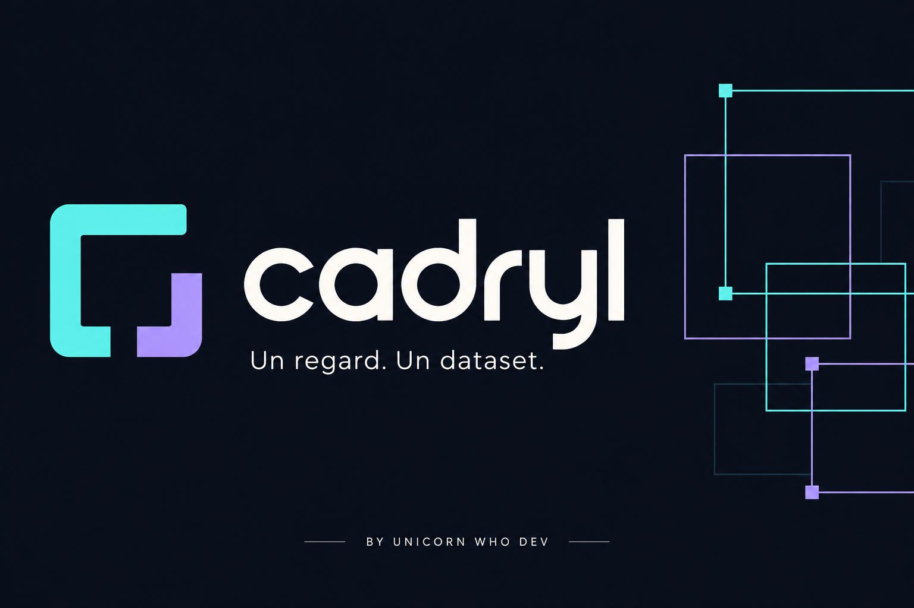
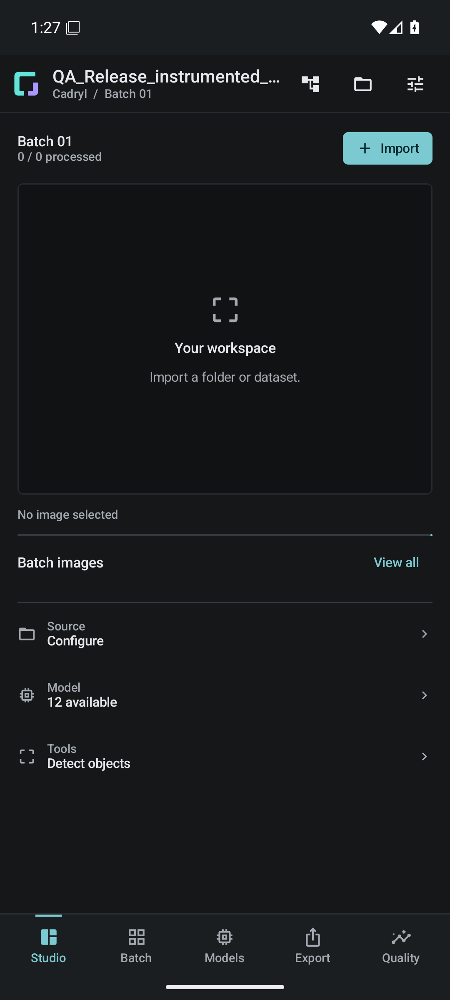

# Cadryl

**Ton atelier Android pour transformer des images en datasets.**

Tu importes tes images, tu vérifies ce que propose le modèle, tu corriges et tu exportes. Cadryl rassemble ces étapes dans une app qui garde tes annotations au centre du travail. Tu peux aussi tout faire à la main, puis entraîner un modèle compatible sur les lots que tu as relus.

Un projet indépendant de **Unicorn Who Dev**, auparavant nommé *Vision Dataset Studio*.

[Télécharger rc6](https://github.com/unicornwhodev/vision-dataset-studio/releases/tag/v4.2.0-rc6) · [Faire son premier lot](docs/GETTING_STARTED.md) · [Documentation](docs/README.md) · [English](README.en.md)

## Ce qu’on peut faire

- **Préparer ses images.** Dossier local ou Hugging Face, travail par petits lots, suivi des doublons et reprise du projet.
- **Annoter avec une aide.** Boîtes, points, masques : le modèle propose, tu ajustes et tu décides. Tes corrections enregistrées restent protégées.
- **Sortir un dataset utilisable.** JSONL complet, puis COCO, YOLO, WebDataset ou vision-langage selon le travail réalisé. La copie doit être relue avant le nettoyage.
- **Faire progresser une copie du modèle.** Le premier entraînement crée une version séparée. Les suivants reprennent ses derniers poids validés. L’original reste disponible.

L’apprentissage est facultatif et désactivé au départ. **Aucun poids de modèle ni dataset n’est livré dans l’APK.** Le parcours manuel fonctionne sans modèle.

## Dans l’app

Capture réelle sur émulateur. La bannière en haut de page est une illustration ; [les visuels et leur provenance](docs/VISUALS.md) sont documentés.

## Essayer Cadryl

Il faut **Android 9 ou plus et un téléphone ARM64**. Télécharge `vision-dataset-studio.apk` dans la release, puis commence avec quelques images dont tu peux disposer. Le nom technique du fichier et l’identifiant Android restent les mêmes pour garder la continuité du projet.

**Tu as déjà rc4 ou rc5 ?** Ces anciennes APK Debug utilisent d’autres clés. rc6 ne peut pas les mettre à jour directement : garde l’installation et ses données. [Installation et signature](docs/GETTING_STARTED.md#installer-cadryl).

Pour les modèles, deux catalogues publics sont documentés : [les conversions Charlbi](https://huggingface.co/Charlbi/Lite_rt_prepared_for_android_dataset_builder) et [les modèles FireViewer](https://huggingface.co/fireviewer/litert-models). Lis les résultats de chaque variante avant de la choisir. Un modèle qui se charge n’est pas forcément précis sur tes images.

## Où en est le projet ?

**4.2.0-rc6 est une préversion.** Les deux APK Release signées passent chacune les 40 tests métier et les 4 scénarios UI sur l’émulateur Android 16 en pages de 16 Ko. L’audit strict des bibliothèques natives passe aussi. Les tests ARM64 y utilisent une traduction : la recette sur un vrai téléphone ARM 16 Ko reste à faire.

Les prochaines étapes sont la recette du nouveau candidat sur téléphone, les essais longs, la qualité des modèles, la CI et la fin de la revue des notices natives. Le crash ART historique n’a pas de cause confirmée. [État des tests](TEST_REPORT.md) · [Limites connues](KNOWN_LIMITATIONS.md) · [Feuille de route](docs/ROADMAP.md).

## Mettre les mains dans le code

L’app utilise **Kotlin, Compose, Room et LiteRT**. Le [guide de développement](docs/DEVELOPMENT_RESUME.md) explique les dépendances natives, le build Windows/Linux et les tests. L’[architecture](docs/ARCHITECTURE.md) donne les repères pour trouver le bon endroit dans le code.

Un bug, une idée ou une amélioration ? [Ouvre une issue](https://github.com/unicornwhodev/vision-dataset-studio/issues) avec la version, l’appareil et les étapes pour reproduire. Les contributions sont les bienvenues ; les règles utiles tiennent dans [CONTRIBUTING.md](CONTRIBUTING.md).

Le code est sous [Apache-2.0](LICENSE). Les modèles, datasets et composants tiers gardent leurs propres conditions. [Licences et attributions](LICENSING_STATUS.md).
