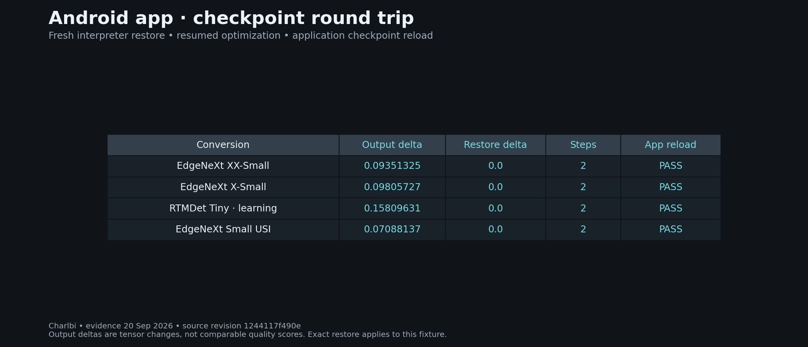
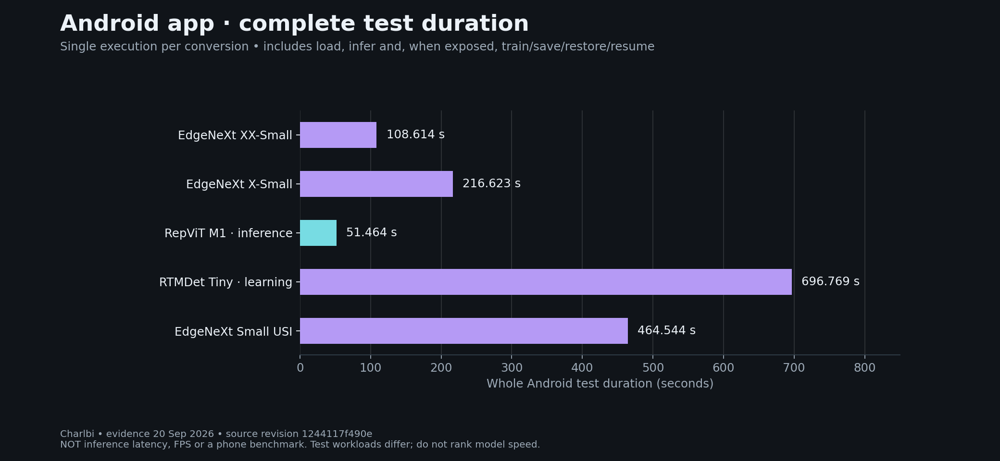

# Qualification LiteRT — audit du 22 septembre 2026

**12 conversions réussies**, dont **7 avec apprentissage Android**, sur 31 conversions téléchargées. RF-DETR a atteint la limite de 30 minutes de l’émulateur logiciel : cet essai ne permet pas de conclure sur sa compatibilité. Les 18 autres conversions sont en cours de recette, dont les six de la source privée. Le défaut RTMDet de rc3 est corrigé et son inférence passe. Aucun identifiant ni poids privé n’est publié.

| Conversion | Inference | Train / save / restore / resume | Output delta | Restore delta | Build |
|---|---|---|---:|---:|---|
| edgenext_xx_small_learning | PASS | PASS | 0.09351325 | 0.0 | `20260922T192944Z-f27bfcef901a` |
| edgenext_x_small_learning | PASS | PASS | 0.09805727 | 0.0 | `20260922T192944Z-f27bfcef901a` |
| repvit_m1 | PASS | — | — | — | `20260922T192944Z-f27bfcef901a` |
| rtmdet_tiny | PASS | — | — | — | `20260922T201906Z-8b8b1f4b8b2d` |
| rtmdet_tiny_learning | PASS | PASS | 0.15809631 | 0.0 | `20260922T192944Z-f27bfcef901a` |
| hgnetv2_b0 | PASS | — | — | — | `20260922T192944Z-f27bfcef901a` |
| edgenext_small_usi_learning | PASS | PASS | 0.07088137 | 0.0 | `20260922T192944Z-f27bfcef901a` |
| repvit_m1_learning | PASS | PASS | 4.5994983 | 0.0 | `20260922T192944Z-f27bfcef901a` |
| tinyclip_learning | PASS | PASS | 0.0015258789 | 0.0 | `20260922T192944Z-f27bfcef901a` |
| efficientformer_l1_learning | PASS | PASS | 0.1378746 | 0.0 | `20260922T204312Z-40a01b844d03` |
| dinov2 | PASS | — | — | — | `20260922T204312Z-40a01b844d03` |
| tinyclip | PASS | — | — | — | `20260922T204312Z-40a01b844d03` |
| rfdetr | TIMEOUT | — | — | — | `20260922T204312Z-40a01b844d03` |

[JSON evidence](../test-results/functional-audit-20260922/public-model-results.json).

Les tests utilisent les APK indiquées dans chaque reçu. Les SHA sont conservés dans ces preuves pour identifier les artefacts testés ; **ils ne conditionnent plus l’import ni l’utilisation dans l’application**. Un modèle sans apprentissage reste utilisable en inférence. Les signatures entraînables actuelles modifient une tête ou une adaptation de sortie, avec encodeur figé. Aucun gain de précision ni résultat sur téléphone ARM n’est revendiqué.

---

# Historique figé — 4.2.0-rc3

**Français** · [English](en/LITERT_QUALIFICATION.md)

État figé le 20 septembre 2026 UTC à la demande du propriétaire. Les essais ont été arrêtés entre deux conversions pour publier la prérelease et fermer le poste. **5 conversions réussies, 1 en échec, 25 restantes** sur les 31 artefacts téléchargés et vérifiés. Aucune qualification complète du catalogue n’est annoncée.

Le dépôt public `Charlbi/Lite_rt_prepared_for_android_dataset_builder` a été épinglé au commit `1244117f490e36ce321d70baa672753caeaef028` : 25 conversions, dont 15 entraînables. Six conversions supplémentaires d’une source privée autorisée ont été téléchargées et vérifiées, dont cinq entraînables ; aucune n’a encore terminé les tests Android. Leurs identifiants, contrats et poids ne sont pas publiés ici.

## Résultats Android exécutés

| Conversion | Inference | Train / save / restore / resume | Output delta | Restore delta | Build |
|---|---|---|---:|---:|---|
| edgenext_xx_small_learning | PASS | PASS | 0.09351325 | 0.0 | `20260920T211135Z-09c558a5b622` |
| edgenext_x_small_learning | PASS | PASS | 0.09805727 | 0.0 | `20260920T204726Z-e97732364106` |
| repvit_m1 | PASS | Not exposed / Non exposé | — | — | `20260920T211135Z-09c558a5b622` |
| rtmdet_tiny_learning | PASS | PASS | 0.15809631 | 0.0 | `20260920T211135Z-09c558a5b622` |
| edgenext_small_usi_learning | PASS | PASS | 0.07088137 | 0.0 | `20260920T212400Z-583fa4f10a2d` |

Preuves : [reçus JSON](../test-results/litert-rc3/models-passed.json), journaux par tentative dans `test-results/litert-rc3/`. Chaque reçu conserve le build réellement exécuté. Les résultats des builds de développement ne sont pas renommés en résultats du build rc3 final ; celui-ci ajoute la version rc3 et repasse ses contrôles de compilation et métier.

Chaque conversion entraînable réussie a effectué deux étapes d’optimiseur **dans Android**, avec sorties modifiées, sauvegarde, restauration dans un nouvel interpréteur, reprise et rechargement du checkpoint par le moteur de l’application. Les fichiers originaux restent inchangés. Les checkpoints ne sont pas activés automatiquement pour la production.

**Périmètre des poids :** les 20 conversions entraînables fournies figent l’encodeur visuel et modifient une tête ou une adaptation de sortie. Elles ne satisfont pas encore la demande d’entraînement de toutes les couches internes. Le petit réseau synthétique de QA modifie réellement ses couches visuelles ; cette preuve est distincte des conversions HF.

## Défaut ouvert et suite à reprendre

`rtmdet_tiny` sans apprentissage exécute son calcul, mais le décodeur refuse la forme d’une carte de sortie. La lecture des sorties dynamiques après invocation est corrigée ; la correspondance forme/pas reste à diagnostiquer. Le test conserve son verdict **FAIL**, distinct du succès de `rtmdet_tiny_learning`. L’application affiche l’erreur et ne fabrique pas d’annotations.

Les 25 autres conversions restent à tester, notamment les six de la source privée, les bundles TinyCLIP/SAM/Florence et les autres classifieurs/détecteurs/pose. Les commandes `fetch_model_fixtures.py`, `stage_android_fixture.py` et `qualify_converted_models.py` conservent les fixtures hors APK et produisent des reçus par cas. Un fichier `STOP_AFTER_CURRENT` dans le répertoire de preuves arrête la file entre deux cas.

La [PR communautaire #10](https://huggingface.co/spaces/litert-community/README/discussions/10) reste ouverte. Elle propose les variantes personnelles absentes du catalogue ; son intégration dépend des mainteneurs. Elle n’inclut aucun modèle privé.

## Limites de la mesure

Runtime CPU Java : LiteRT 1.4.2 + Select TF Ops 2.16.1 ; émulateur AOSP API 28 x86_64 sans KVM. Entrée synthétique et corrections construites selon chaque contrat. Ces essais vérifient exécution, mise à jour et persistance ; ils ne mesurent ni précision métier, ni gain de généralisation, ni performance sur téléphone ARM. Aucun optimiseur n’a tourné dans Linux sur l’hôte du pod. Aucun poids n’est embarqué dans l’APK.

## Résultats en images

La durée comprend chargement, plusieurs inférences et, lorsque disponibles, apprentissage et checkpoints. Ce n’est pas une latence d’inférence ni un benchmark téléphone. Chaque ligne est une exécution unique ; les charges diffèrent. [Reproducible values and image provenance](VISUALS.md).

[Le rapport complet des modèles](https://huggingface.co/Charlbi/Lite_rt_prepared_for_android_dataset_builder/blob/main/docs/BENCHMARKS.md) distingue conversion sur hôte, rapport SDK autonome de RepViT entraînable et cette campagne applicative. Le rapport SDK ne modifie pas les comptes de couverture de l’application.
