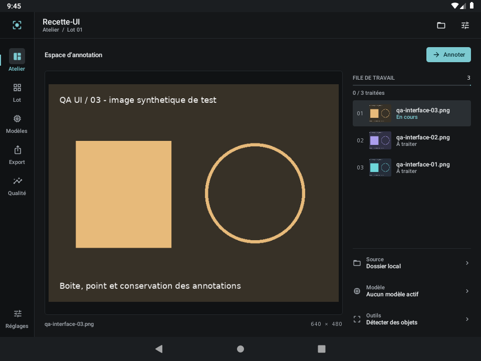
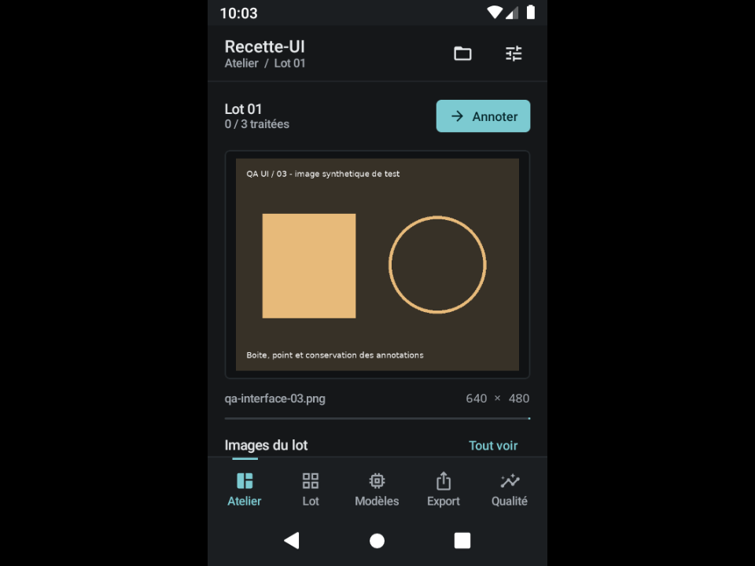

# Affinage de l’interface de travail

Cette révision répond au retour du propriétaire sur l’aspect trop générique de
l’application. Elle réorganise les surfaces natives Compose autour de l’image,
de la file de travail et des commandes utiles.

## Changements

- **Atelier** : un grand aperçu intégral, une file d’images sélectionnables et les
  paramètres du projet à droite sur grand écran. Sur téléphone, aperçu puis file
  courte dans une page défilante. Le bouton Annoter ouvre l’image sélectionnée.
- **Navigation** : rail graphite de 68 dp, indicateur cyan discret, pictogrammes
  de 19 dp ; barre basse plus compacte sur téléphone.
- **Commandes** : boutons de largeur naturelle, fond visible d’environ 32 dp de
  hauteur, cible interactive d’au moins 48 dp. L’accent reste réservé aux actions
  principales et aux sélections.
- **Lot** : vignettes plus grandes sur tablette, images entières, filtres en texte
  et états regroupés sous le nom de fichier.
- **Modèles** : liste à séparateurs fins, téléchargement et détails accessibles
  directement. Les états distinguent inspection, contrat heatmap, bundle et
  conversion à venir ; le badge générique « Compatible » a été retiré.
- **Éditeur** : canevas conservé, précédent/suivant directement accessibles sur
  grand écran, dimensions du média et liste structurée des régions dans les
  propriétés. L’ouverture d’un panneau ne change pas les annotations.
- **Export** : largeur de lecture limitée et actions de largeur naturelle.
- **Style commun** : gris graphite plus neutres, rayons de 4–8 dp sur les surfaces
  courantes, textes plus hiérarchisés, transitions courtes de 160 ms sans rebond.

Les images présentées dans les captures sont les fixtures synthétiques du projet
séparé Recette-UI. Aucun exemple n’est injecté dans un projet utilisateur. Les
capacités d’inférence, d’entraînement et de publication conservent les limites
décrites dans l’audit fonctionnel.

## Recette

Build `20260919T213548Z-f221e25ccc2f`, APK principale SHA-256
`33c92f9dff96de110a0b0334467bc6fc0d96d34f443ec49d636c2ef994835175`.
Les deux APK ont été compilées, contrôlées puis installées sans effacer les données.
Les deux tests Compose passent à 960 dp (81,557 s JUnit), puis à 320 dp
(79,351 s JUnit). Le test d’accueil vérifie maintenant l’action directement
visible, sans demander un défilement devenu inutile sur grand écran.

La sélection de qa-interface-01 ouvre bien cette image et ses zéro annotations.
Le retour à qa-interface-03 conserve sa boîte. Dessiner, annuler, rétablir puis
annuler produit les comptes 1 → 2 → 1 → 2 → 1, sans modifier le résultat initial.
L’aperçu desktop dispose de 579 × 471 px ; l’image 4:3 y occupe 579 × 434 px.
La commande Annoter mesure environ 90 px de large. Les captures utilisent les
images synthétiques de recette.

Le build global reste en échec sur le test de reprise HTTP déjà identifié
(25/26 tests JVM). La suite SAF bloquée n’a pas été qualifiée par ces tests UI.
Cette révision n’est pas une validation de publication ni un benchmark téléphone.
