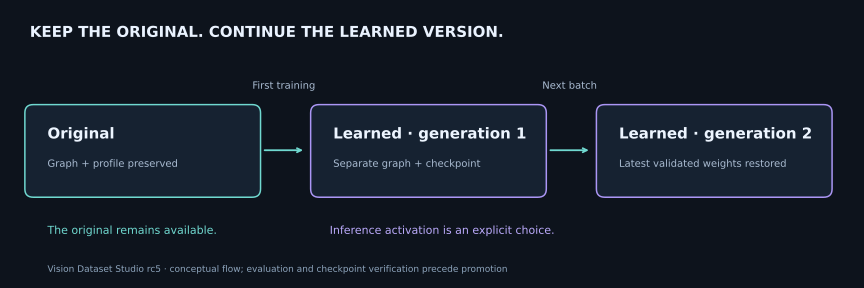

# Keep the original and continue training

The original stays available. The first training run creates a separate version; later runs continue its last validated weights. The [rc6 results](../RC6_RELEASE.md) include a fresh check of this behaviour.

[Documentation](../README.md) · [Français](../MODEL_LINEAGE.md)

For each project and starting model, Vision Dataset Studio keeps two logical versions: **the original** and **the learned version**.

1. The first run copies the graph to a separate private directory. The original graph, imported profile and digest remain available.
2. Successful evaluation and verified save/restore advance the learned version. Its profile keeps a stable identity across generations.
3. The next batch restores the latest validated learned weights, even if the original is still selected for inference. Lineage persists on disk.
4. Inference activation remains explicit. Errors, interruptions and rejected evaluations do not replace the last validated generation. Resume restores the interrupted attempt's checkpoint.

Each attempt has a separate directory and checkpoint. Promotion atomically replaces a lineage receipt after verification; it does not rewrite the original or earlier weights. **The graph and checkpoint belong together**: copying only the `.tflite` graph does not transfer learned parameters.

A missing or modified learned checkpoint blocks continuation instead of silently resetting to initial weights. Batch cleanup retains referenced models, checkpoints and receipts. Another project or model contract has independent lineage. Older receipts remain readable without inventing missing provenance.

## Recorded evidence

Build `20260923T104142Z-befce3e3596a`: **39/39 core tests on API 35 with 4 KB pages and 39/39 with 16 KB pages**. The first batch's final weights equal the second batch's initial weights. The original graph/profile remain unchanged, and persisted files have identical hashes after process restart.

[4 KB evidence](../../test-results/windows-rc5-release/api35-4k/status.json) · [16 KB evidence](../../test-results/windows-rc5-release/api35-16k/status.json) · [Restart integrity](../../test-results/windows-rc5-release/api35-16k/lineage-after-process-restart.json).

These are synthetic functional checks. Current HF conversions update heads or output adapters with frozen visual backbones; they do not establish full-backbone training, task accuracy or better generalization.
