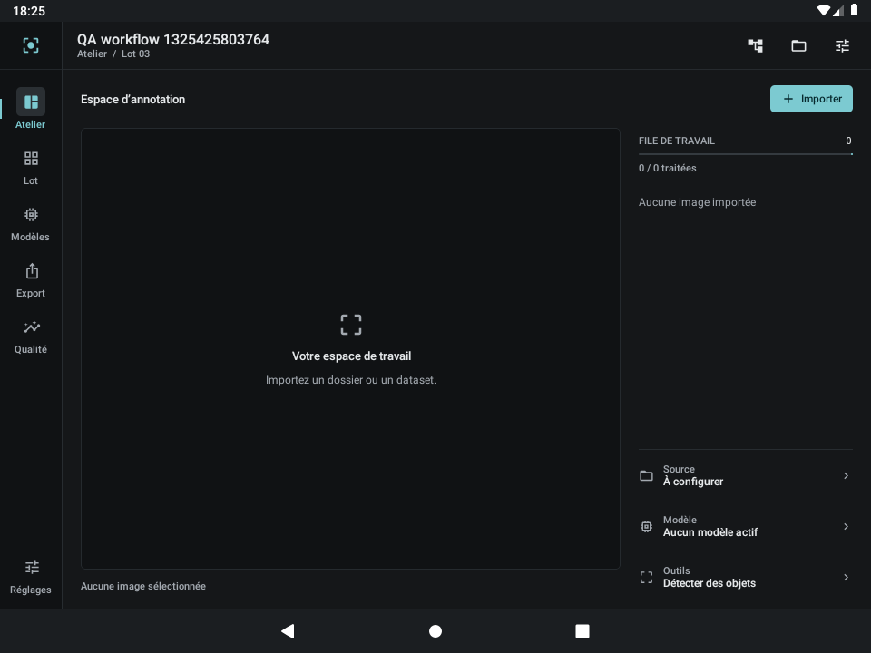
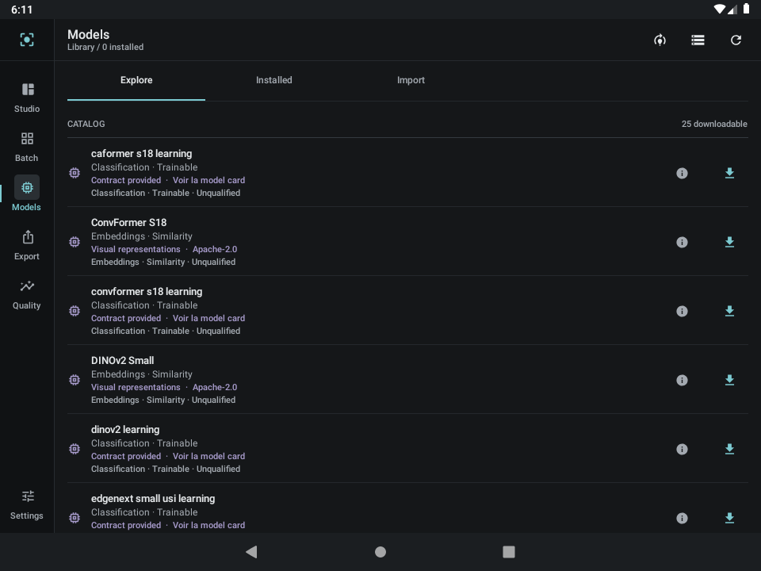

# Validation du 22 septembre 2026 / Validation on 22 September 2026

## Français

La dernière version `main` récupérée est `351dd3f3ba2a50f86e62137f24780699da0d4ac2`.
Le build corrigé est **`20260922T175957Z-8ef3e5cc2b0d`**, version Android **4.2.0-rc3**.
Les [181 empreintes de sources](compiled-source-manifest.json) correspondent toutes
aux fichiers locaux corrigés. Cette session ne remplace pas la release rc3 déjà publiée.

### Corrections

- Ajout des **125 ressources manquantes**, en français et en anglais, avec contrôle des références Kotlin pour empêcher leur omission.
- Correction de la syntaxe et des capacités VQA/comptage/grounding dans le catalogue, de l’import de `MaskCodec`, de l’opt-in Compose et de deux accès à des valeurs nullables.
- Tests Compose de navigation adaptés à la langue effective de l’appareil ; les assertions de visibilité et les interactions sont conservées.
- Dépendances manquantes rétablies dans les lanceurs Kotlin portables. Contrôles mis à jour pour le preset segmentation et la revue humaine obligatoire du grounding.
- Rapports et sorties Gradle exclus du contrôle des sources et des fichiers à commiter.

### Résultats exécutés

| Contrôle | Résultat |
|---|---|
| Compilation, signature, identité, installation | APK utilisateur et APK de tests réelles ; mises à jour sans désinstallation |
| JVM | **54 réussis**, aucun échec ni ignoré |
| Lint | **0 erreur, 89 avertissements** |
| Android API 28 x86_64 | **24 réussis, 10 ignorés, 0 échec**, 205,008 s |
| Python | **48 réussis** |
| Kotlin portable | **44 règles**, **72 contrôles moteur**, **16 cibles d’apprentissage** ; autres contrôles de reprise/SQLite/export réussis |
| Poids dans l’APK | Aucun ; contrôle du contenu dans le reçu de build |
| Concordance des sources | **181 fichiers, 0 différence** |

Les 10 tests ignorés sont les neuf modèles de `HfModelRuntimeTest` dont les poids
n’étaient pas injectés, et le test générique de conversion sans argument `modelCase`.
Le résultat JUnit brut indique « OK (34 tests) » : **cela ne signifie pas 34 exécutions réussies**.
Les conversions sélectionnées séparément sont consignées dans [conversions.json](conversions.json) :

| Conversion épinglée | Régression sur cette APK |
|---|---|
| `edgenext_xx_small_learning` | Inférence, 2 étapes Android, changement de sortie 0,09351325, sauvegarde/restauration sans écart, reprise et chargement du checkpoint par le moteur applicatif : réussis |
| `repvit_m1` | Inférence réussie, représentation finie de 384 valeurs ; cette conversion n’expose pas d’apprentissage |

Ces deux modèles avaient déjà une qualification antérieure : le nombre global de
modèles qualifiés n’augmente pas. La révision testée est
`1244117f490e36ce321d70baa672753caeaef028`, pas une prétention de tester le dernier
commit documentaire HF. EdgeNeXt ne modifie que sa tête ; son encodeur reste figé.

Les tests Android couvrent notamment les nouvelles maintenances, leur reprise après
interruption injectée, la conservation des profils partagés et des reçus, les lots et
doublons, Room, SAF injecté, les masques, les ressources anglaises et la navigation.
Le scénario d’apprentissage utilise **88 images acceptées et exportées**, exclut
**8 rejets** ainsi qu’un lot voisin, interrompt/reprend l’exécution jusqu’à **198 étapes**,
puis autorise le nettoyage. Checkpoint appris et image du lot voisin restent présents.
L’optimiseur s’exécute dans Android ; aucun entraînement n’est lancé sur l’hôte Linux.

APK utilisateur : **366 822 260 octets**.
SHA-256 : `ce2035bae979282c1a577ff5de4f3653a5dee45838f8c67a7f8009093af53324`.
La clé Debug persistante a été conservée hors Git. Aucun poids, token ou secret ne fait
partie de ces preuves sélectionnées.

### Contrôle visuel et limites

| Atelier en français | Catalogue en anglais |
|---|---|
|  |  |

Captures réelles de l’APK corrigée : navigation française contrôlée après changement de langue et catalogue anglais public de 25 variantes. Les capacités
restent distinctes du statut de qualification. L’anglais contient encore quelques
textes spécialisés en français ; cette session ne certifie pas une traduction exhaustive.

Un dialogue **« System UI isn’t responding »** de l’émulateur a été observé ; le journal
ActivityManager situe cet ANR système au démarrage. La suite a terminé, le bouton
« Wait » a été actionné, puis le catalogue a été contrôlé sans ce dialogue. La trace
et les premières tentatives sont conservées sur le poste. Cet incident n’est pas
présenté comme un crash de l’application, ni comme une preuve de stabilité du système.

Poste : CPU Runpod 8 vCPU / 16 Go, volume conservé, SSH et noyau Jupyter vérifiés depuis
le Chromebook. L’émulation sans KVM reste impropre aux benchmarks de téléphone ARM.
Appareil physique, précision des modèles, autres conversions, serveur grounding/agent
réel et écritures HF de recette restent à qualifier. Les échecs historiques RTMDet et
les limites d’apprentissage des encodeurs restent inchangés.

## English

The corrected build **`20260922T175957Z-8ef3e5cc2b0d`** uses the latest retrieved
`main` revision **`351dd3f`** plus the recorded fixes. All **181 source hashes** match
the local corrected files. This session does not replace the published rc3 release.

The fixes restore **125 missing strings in both languages**, repair Kotlin compilation
in training, the editor, setup and the model catalogue, make navigation tests use the
device locale, and repair portable test dependencies. Generated Gradle artifacts are
excluded from the source identity guard and Git. A new guard checks all Kotlin string
references, including instrumentation sources.

Executed results: **54 JVM tests passed; 48 Python tests passed; lint 0 errors / 89 warnings**.
On Android API 28 x86_64, **24 tests passed, 10 were skipped, none failed** in **205.008 s**.
The skips are nine unstaged HF model fixtures and the parameterized conversion test
without a selected case. JUnit’s “OK (34 tests)” must not be interpreted as 34 executed
successes. Separately selected real conversions are recorded in [conversions.json](conversions.json):
**EdgeNeXt XX Small learning passed inference, two Android optimizer steps, save/restore
with zero output difference, resume, and application-engine checkpoint loading**.
Its output changed by 0.09351325; only its classification head is trainable.
**RepViT M1 passed inference with a finite 384-value representation** and exposes no
training signature. Both use pinned revision `1244117f490e36ce321d70baa672753caeaef028`.
These are regressions of previously qualified models and do not increase catalogue coverage.
Portable policy/engine/training-target checks passed **44 / 72 / 16** respectively.

Android coverage includes maintenance and interrupted-cleanup recovery, preserved
profiles/receipts, batch deduplication, Room, injected SAF failures, mask gestures,
English resources and navigation. The learning workflow uses **88 exported, accepted
images**, excludes **8 rejected images** and a neighbouring batch, resumes through
**198 optimizer steps**, and only then permits cleanup. Checkpoints and unrelated
images survive. All optimizer steps run in Android, not on the Linux host.

The **366,822,260-byte** user APK has SHA-256
`ce2035bae979282c1a577ff5de4f3653a5dee45838f8c67a7f8009093af53324`.
Its weight inventory is empty. The persistent debug signing key remains outside Git.

A boot-time **System UI ANR** was observed in the software emulator and retained as
an infrastructure limitation. The suite completed, the dialog was dismissed with
“Wait”, and the catalogue was then visually checked. Both screenshots above are from the
actual corrected APK; French navigation was checked after changing the emulator locale. Some specialized UI text still falls back to French.

The replacement workstation has **8 vCPU / 16 GiB**, persistent storage, and externally
verified SSH and authenticated Jupyter. No KVM or physical ARM device is available;
these results do not measure phone performance or model accuracy. Other conversions,
real grounding/agent services and authorized remote HF publication remain pending.
